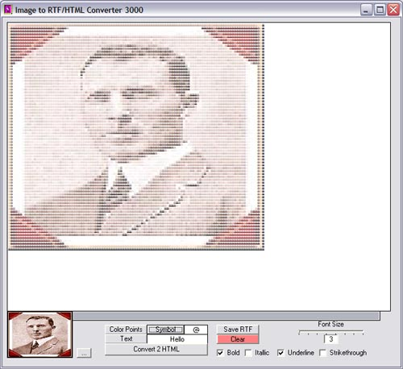



## Image to RTF/HTML \(kinda neat\)

### Description

Converts any image into RTF or HTML. You can create a picture out of words, symbols or numbers. Display pictures on webpages made completely from the page's text.
 
### More Info
 

             |
---                |---
**Submitted On**   |2003-01-27 19:56:34
**By**             |[K\. Michael Farris](https://github.com/Planet-Source-Code/PSCIndex/blob/master/ByAuthor/k-michael-farris.md)
**Level**          |Beginner
**User Rating**    |4.8 (24 globes from 5 users)
**Compatibility**  |VB 5\.0, VB 6\.0
**Category**       |[Graphics](https://github.com/Planet-Source-Code/PSCIndex/blob/master/ByCategory/graphics__1-46.md)
**World**          |[Visual Basic](https://github.com/Planet-Source-Code/PSCIndex/blob/master/ByWorld/visual-basic.md)
**Archive File**   |[Image\_to\_R1535591272003\.zip](https://github.com/Planet-Source-Code/k-michael-farris-image-to-rtf-html-kinda-neat__1-42756/archive/master.zip)

